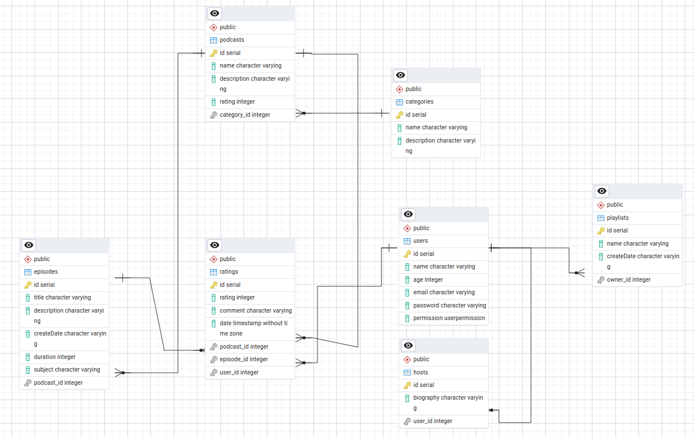

# Visão de Dados


## Introdução

Visão geral dos dados persistentes, o qual mapeia dos objetos aos dados. Trata-se, basicamente, de uma visão do modelo de dados, visualizada com diagramas de classe, os quais são usados para descrever especificamente esse modelo de dados. Para isso o grupo utilizou da linguagem de dados relacionais PostgreSQL, diagrama lógico de dados (DLD) e Dicionário de Dados. Tudo isso para uma melhor comprenssão do projeto e suas regras de negócio aplicadas.

Para reproduções posteriores é possível usar o script SQL físico contido neste artefato.


## Tecnologias usadas

- [PostgreSQL](https://www.postgresql.org/)
- [PgAdmin](https://www.pgadmin.org/)
- [SQLAlchemy (Python ORM)](https://www.sqlalchemy.org/)


## Dicionário de Dados - Plataforma de Podcast

### Tabela: `podcasts`
A tabela `podcasts` armazena informações básicas sobre os podcasts disponíveis na plataforma, como o nome, descrição, classificação e a categoria à qual pertencem. Cada podcast é associado a uma categoria através de uma chave estrangeira (`category_id`).

| Atributo       | Tipo               | Descrição                                          |
|----------------|--------------------|----------------------------------------------------|
| id             | serial             | Identificador único do podcast.                    |
| name           | character varying  | Nome do podcast.                                   |
| description    | character varying  | Descrição do podcast.                              |
| rating         | integer            | Classificação geral do podcast.                    |
| category_id    | integer            | Identificador da categoria (chave estrangeira).    |

### Tabela: `categories`
A tabela `categories` armazena as diferentes categorias que podem ser atribuídas aos podcasts. Cada categoria tem um nome e uma descrição, permitindo a organização dos podcasts de acordo com temas ou tópicos.

| Atributo       | Tipo               | Descrição                                          |
|----------------|--------------------|----------------------------------------------------|
| id             | serial             | Identificador único da categoria.                  |
| name           | character varying  | Nome da categoria.                                 |
| description    | character varying  | Descrição da categoria.                            |

### Tabela: `episodes`
A tabela `episodes` contém informações sobre os episódios individuais de cada podcast. Inclui detalhes como o título, descrição, data de criação, duração e o assunto do episódio. Cada episódio está vinculado a um podcast específico através da chave estrangeira (`podcast_id`).

| Atributo       | Tipo               | Descrição                                          |
|----------------|--------------------|----------------------------------------------------|
| id             | serial             | Identificador único do episódio.                   |
| title          | character varying  | Título do episódio.                                |
| description    | character varying  | Descrição do episódio.                             |
| createDate     | character varying  | Data de criação do episódio.                       |
| duration       | integer            | Duração do episódio em minutos.                    |
| subject        | character varying  | Assunto do episódio.                               |
| podcast_id     | integer            | Identificador do podcast (chave estrangeira).      |

### Tabela: `ratings`
A tabela `ratings` armazena as avaliações feitas pelos usuários sobre os podcasts e episódios. Cada avaliação inclui uma nota, um comentário, a data da avaliação, e está associada a um podcast, episódio, e usuário específico. Esta tabela permite que os usuários expressem suas opiniões sobre o conteúdo.

| Atributo       | Tipo                       | Descrição                                          |
|----------------|----------------------------|----------------------------------------------------|
| id             | serial                     | Identificador único da avaliação.                  |
| rating         | integer                    | Nota da avaliação.                                 |
| comment        | character varying          | Comentário da avaliação.                           |
| date           | timestamp without time zone| Data da avaliação.                                 |
| podcast_id     | integer                    | Identificador do podcast (chave estrangeira).      |
| episode_id     | integer                    | Identificador do episódio (chave estrangeira).     |
| user_id        | integer                    | Identificador do usuário (chave estrangeira).      |

### Tabela: `users`
A tabela `users` armazena as informações dos usuários da plataforma, como nome, idade, email, senha e o tipo de permissão que possuem. Esses dados são essenciais para identificar e autenticar os usuários, além de gerir suas interações com o conteúdo da plataforma.

| Atributo       | Tipo               | Descrição                                          |
|----------------|--------------------|----------------------------------------------------|
| id             | serial             | Identificador único do usuário.                    |
| name           | character varying  | Nome do usuário.                                   |
| age            | integer            | Idade do usuário.                                  |
| email          | character varying  | Email do usuário.                                  |
| password       | character varying  | Senha do usuário.                                  |
| permission     | userpermission     | Tipo de permissão do usuário.                      |

### Tabela: `hosts`
A tabela `hosts` armazena informações sobre os hosts (apresentadores) dos podcasts. Um host é vinculado a um usuário específico através da chave estrangeira (`user_id`). Esta tabela permite a criação de perfis detalhados para os apresentadores dos podcasts, incluindo biografias.

| Atributo       | Tipo               | Descrição                                          |
|----------------|--------------------|----------------------------------------------------|
| id             | serial             | Identificador único do host.                       |
| biography      | character varying  | Biografia do host.                                 |
| user_id        | integer            | Identificador do usuário (chave estrangeira).      |

### Tabela: `playlists`
A tabela `playlists` permite que os usuários criem e gerenciem listas de reprodução personalizadas. Cada playlist tem um nome, data de criação, e está vinculada a um proprietário (usuário) através da chave estrangeira (`owner_id`). Isso possibilita que os usuários organizem seus episódios favoritos de maneira personalizada.

| Atributo       | Tipo               | Descrição                                          |
|----------------|--------------------|----------------------------------------------------|
| id             | serial             | Identificador único da playlist.                   |
| name           | character varying  | Nome da playlist.                                  |
| createDate     | character varying  | Data de criação da playlist.                       |
| owner_id       | integer            | Identificador do proprietário (chave estrangeira). |


### DLD (Diagrama Lógico de Dados)



Figura 1: Diagrama DLD. Fonte: [Bruno Henrique](https://github.com/BrunoHenrique00)

### Implementação SQLAlchemy (ORM)

Todos as classes foram mapeadas usando o ORM. Todo código necessário dos models(entidades) se encontra [AQUI](https://github.com/UnBArqDsw2024-1/2024.1_G5_My_AudioPodCast/tree/main/backend/app/models)

### Implementação SQL Script Físico

``` sql
CREATE DATABASE IF NOT EXISTS meuPodcast;

USE meuPodcast;

BEGIN;


CREATE TABLE IF NOT EXISTS public.categories
(
    id serial NOT NULL,
    name character varying COLLATE pg_catalog."default",
    description character varying COLLATE pg_catalog."default",
    CONSTRAINT categories_pkey PRIMARY KEY (id)
);

CREATE TABLE IF NOT EXISTS public.episodes
(
    id serial NOT NULL,
    title character varying COLLATE pg_catalog."default",
    description character varying COLLATE pg_catalog."default",
    "createDate" character varying COLLATE pg_catalog."default",
    duration integer,
    subject character varying COLLATE pg_catalog."default",
    podcast_id integer,
    CONSTRAINT episodes_pkey PRIMARY KEY (id)
);

CREATE TABLE IF NOT EXISTS public.hosts
(
    id serial NOT NULL,
    biography character varying COLLATE pg_catalog."default",
    user_id integer,
    CONSTRAINT hosts_pkey PRIMARY KEY (id)
);

CREATE TABLE IF NOT EXISTS public.playlists
(
    id serial NOT NULL,
    name character varying COLLATE pg_catalog."default",
    "createDate" character varying COLLATE pg_catalog."default",
    owner_id integer,
    CONSTRAINT playlists_pkey PRIMARY KEY (id)
);

CREATE TABLE IF NOT EXISTS public.podcasts
(
    id serial NOT NULL,
    name character varying COLLATE pg_catalog."default",
    description character varying COLLATE pg_catalog."default",
    rating integer,
    category_id integer,
    CONSTRAINT podcasts_pkey PRIMARY KEY (id)
);

CREATE TABLE IF NOT EXISTS public.ratings
(
    id serial NOT NULL,
    rating integer,
    comment character varying COLLATE pg_catalog."default",
    date timestamp without time zone,
    podcast_id integer,
    episode_id integer,
    user_id integer,
    CONSTRAINT ratings_pkey PRIMARY KEY (id)
);

CREATE TABLE IF NOT EXISTS public.users
(
    id serial NOT NULL,
    name character varying COLLATE pg_catalog."default",
    age integer,
    email character varying COLLATE pg_catalog."default",
    password character varying COLLATE pg_catalog."default",
    permission userpermission,
    CONSTRAINT users_pkey PRIMARY KEY (id)
);

ALTER TABLE IF EXISTS public.episodes
    ADD CONSTRAINT podcast_id FOREIGN KEY (podcast_id)
    REFERENCES public.podcasts (id) MATCH SIMPLE
    ON UPDATE NO ACTION
    ON DELETE NO ACTION
    NOT VALID;


ALTER TABLE IF EXISTS public.hosts
    ADD CONSTRAINT hosts_user_id_fkey FOREIGN KEY (user_id)
    REFERENCES public.users (id) MATCH SIMPLE
    ON UPDATE NO ACTION
    ON DELETE NO ACTION;


ALTER TABLE IF EXISTS public.playlists
    ADD CONSTRAINT playlists_owner_id_fkey FOREIGN KEY (owner_id)
    REFERENCES public.users (id) MATCH SIMPLE
    ON UPDATE NO ACTION
    ON DELETE NO ACTION;


ALTER TABLE IF EXISTS public.podcasts
    ADD CONSTRAINT podcasts_category_id_fkey FOREIGN KEY (category_id)
    REFERENCES public.categories (id) MATCH SIMPLE
    ON UPDATE NO ACTION
    ON DELETE NO ACTION;


ALTER TABLE IF EXISTS public.ratings
    ADD CONSTRAINT ratings_episode_id_fkey FOREIGN KEY (episode_id)
    REFERENCES public.episodes (id) MATCH SIMPLE
    ON UPDATE NO ACTION
    ON DELETE NO ACTION;


ALTER TABLE IF EXISTS public.ratings
    ADD CONSTRAINT ratings_podcast_id_fkey FOREIGN KEY (podcast_id)
    REFERENCES public.podcasts (id) MATCH SIMPLE
    ON UPDATE NO ACTION
    ON DELETE NO ACTION;


ALTER TABLE IF EXISTS public.ratings
    ADD CONSTRAINT ratings_user_id_fkey FOREIGN KEY (user_id)
    REFERENCES public.users (id) MATCH SIMPLE
    ON UPDATE NO ACTION
    ON DELETE NO ACTION;

END;
```


## Histórico de Versão

| Data       | Versão | Modificação                      | Autor          | Revisor            |
|------------|--------|----------------------------------|----------------|--------------------|
| 13/08/2024 | 1.0    | Criação e confeecção do artefato | [Bruno Henrique](https://github.com/BrunoHenrique00) | Mateus Franco |
| 16/08/2024 | 1.1    | Revisão do artefato | [Mateus Franco](https://github.com/Mateusvff) | - |