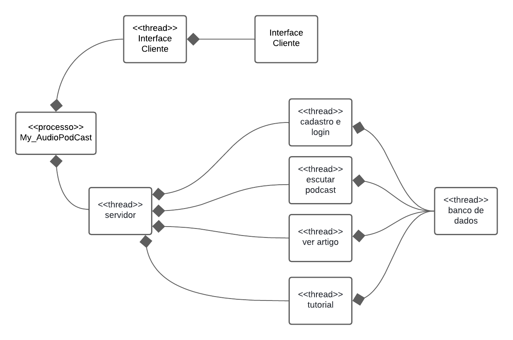

# DAS - Documento de Arquitetura de Software

## Introdução 
A Arquitetura de Software é fundamental no processo de desenvolvimento de sistemas, pois estabelece a base estrutural do software, define os principais componentes e as interações entre eles. Ela vai além da simples codificação, abrangendo decisões essenciais que impactam diretamente o desempenho, a segurança, a escalabilidade e a funcionalidade do sistema. A criação de uma arquitetura sólida é essencial para garantir que o software atenda aos requisitos estabelecidos, permitindo também a manutenção, a flexibilidade e a evolução do sistema ao longo do tempo. O Documento de Arquitetura de Software (DAS) desempenha um papel crucial ao documentar essas decisões, assegurando que as diferentes visões do projeto estejam alinhadas e evitando conflitos futuros.

### Objetivo
O objetivo deste documento é apresentar diferentes perspectivas da arquitetura concebida para o projeto, além de descrever casos de uso que envolvem o sistema proposto, servindo como uma referência detalhada do que foi desenvolvido.

### Escopo
Este documento abrange todo o design arquitetônico elaborado no projeto, proporcionando uma compreensão mais clara do que foi desenvolvido para futuros leitores.

### Definições, acrônimos e abreviações
- **DAS - Documento de Arquitetura de Software:** Este documento aborda e detalha a arquitetura de um sistema de software, utilizando diversas visões e casos de uso para descrever a estrutura e os componentes do sistema.

## Representação Arquitetural
### Descrição Geral da Arquitetura
- **Back-End:** Para a implementação do nosso Back-End, utilizamos a linguagem de programação Python. Python é amplamente reconhecida por sua simplicidade e eficiência, além de oferecer uma vasta gama de bibliotecas e frameworks que aceleram o desenvolvimento de aplicações modernas. A escolha por Python reflete nossa busca por uma solução robusta e ágil para o desenvolvimento do sistema.

- **Front-End:** Para o Front-End, optamos por utilizar .tsx, que combina a flexibilidade do TypeScript com a sintaxe do JSX, facilitando o desenvolvimento de interfaces de usuário dinâmicas e interativas. Essa escolha garante uma melhor tipagem e maior segurança no código, além de melhorar a produtividade durante o desenvolvimento.

- **Banco de Dados:** Para o Banco de Dados, utilizamos o PostgreSQL, um sistema de gerenciamento de banco de dados relacional conhecido por sua robustez e flexibilidade. PostgreSQL oferece suporte avançado a transações, integridade referencial e extensibilidade, o que o torna ideal para lidar com as complexas regras de negócio do nosso projeto.

## Visão Lógica
A visão lógica da arquitetura de software ilustra a organização do sistema em termos de pacotes, classes e suas interações. Ela enfoca as responsabilidades principais de cada componente e como eles se relacionam entre si.

- **Diagrama de Classes:** O diagrama de classes fornece uma representação visual das classes dentro de um sistema de software, evidenciando suas propriedades, métodos e as relações estabelecidas entre elas. Essencial na fase de design, esse diagrama oferece uma visão clara e abstrata da estrutura do sistema, funcionando como um alicerce para o desenvolvimento e implementação do software.
  Clique [aqui](https://unbarqdsw2024-1.github.io/2024.1_G5_My_AudioPodCast/#/./Modelagem/2.1.1.2.DiagramaClasses) para visualizar.

- **Diagrama de Pacotes:** Diagramas de pacotes são utilizados para simplificar diagramas de classe complexos ao agrupar classes em pacotes organizados. Cada pacote contém elementos inter-relacionados, como diagramas, documentos, classes e eventos. Esses diagramas oferecem uma visão geral útil para projetos e sistemas extensos, ajudando a entender a estrutura global e as conexões entre diferentes pacotes.
  Clique [aqui](https://unbarqdsw2024-1.github.io/2024.1_G5_My_AudioPodCast/#/./Modelagem/2.1.1.1.DiagramadePacotes) para visualizar.

- **Diagrama de Implementação:** O diagrama de implementação ilustra a disposição dos componentes físicos do sistema e sua interação com o ambiente. Ele representa a arquitetura de hardware e software, mostrando como os componentes de software são distribuídos e conectados aos recursos de hardware. Esse diagrama é essencial para entender como o sistema será configurado e operado em um ambiente real, fornecendo uma visão prática da estrutura e facilitando a identificação de requisitos de infraestrutura e configurações necessárias.
  Clique [aqui](https://unbarqdsw2024-1.github.io/2024.1_G5_My_AudioPodCast/#/./Modelagem/2.1.1.3.DiagramaImplemetacao) para visualizar.

- **Diagrama de Componentes:** O diagrama de componentes da UML fornece uma visão visual da organização das classes por meio de componentes de trabalho. Ele é uma ferramenta crucial para entender a arquitetura de um sistema, ilustrando como os diversos componentes, que podem abranger classes, módulos, pacotes ou até sistemas inteiros, interagem e se relacionam entre si.
  Clique [aqui](https://unbarqdsw2024-1.github.io/2024.1_G5_My_AudioPodCast/#/./Modelagem/2.1.1.4.DiagramaComponente) para visualizar.

## Visão de Processos
Para o projeto, foi desenvolvido um diagrama de processo que explicita os fluxos em forma de threads, responsáveis pela execução das atividades essenciais do sistema. As interações ocorrem por meio de funções representativas que orientam o fluxo do processo com base nas operações possíveis.

_Imagem 1: Diagrama de processo(Fonte: Milena Aires, 2024)_

Sobre o diagrama acima representado, podemos ver que o My_AudioPodCast esta sendo particionada em dois processos, a "Interface do Cliente" que é a parte onde tem contato com o usuário, e temos também o Servidor, no qual estão contidos os processos ou threads demonstrados. 

## Referências
> Bass, L., Clements, P., & Kazman, R. (2012). Software Architecture in Practice (3rd ed.). Addison-Wesley.

> Fowler, M., & Scott, K. (1997). UML Distilled: A Brief Guide to the Standard Object Modeling Language. Addison-Wesley.

## Histórico de Versão

| Data       | Versão | Modificação                      | Autor          | Revisor            |
|------------|--------|----------------------------------|----------------|--------------------|
| 15/08/2024 | 1.0    | Criação e início da confeecção do artefato | Milena Aires | Samuel Macedo |
| 15/08/2024 | 1.1    | Visão de Processos | Milena Aires | Samuel Macedo |
