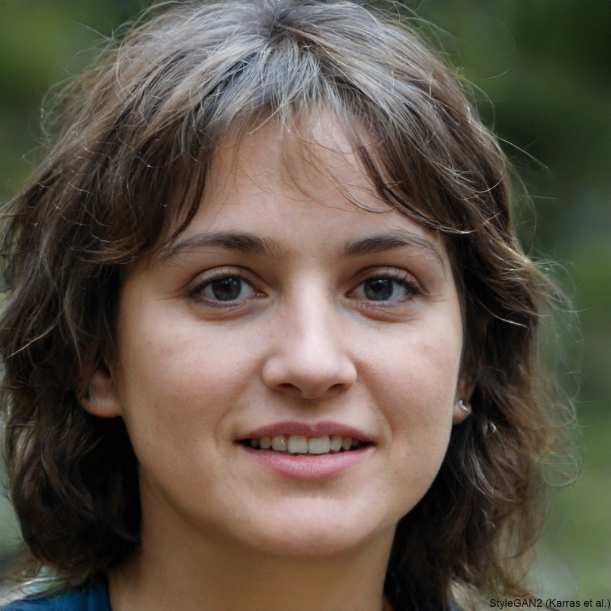
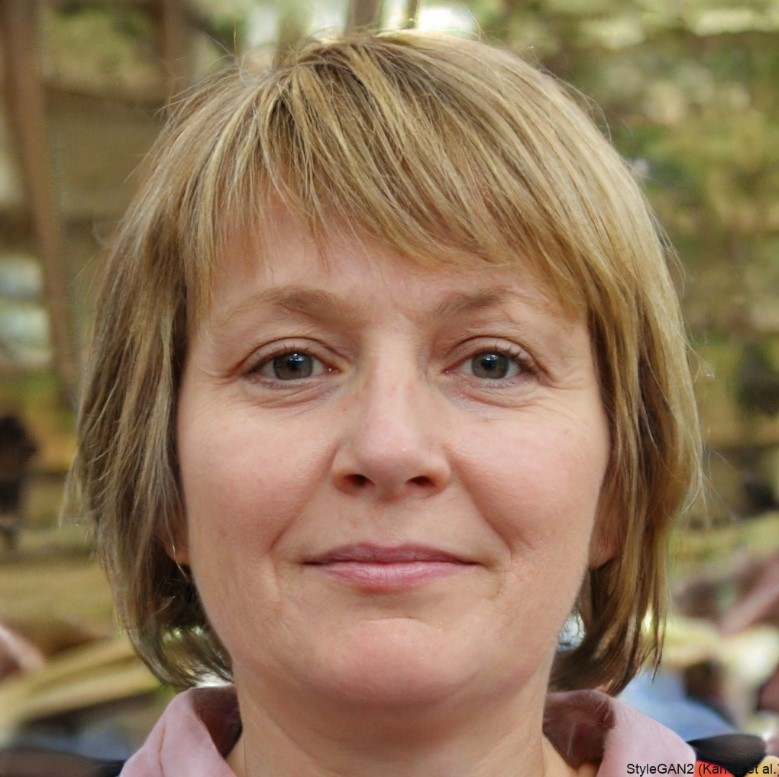

# Personas

## Introdução

Este é um método de elicitação muito utilizado. Personas são pessoas fictícias criadas pelos desenvolvedores e projetistas de sistemas para representar os usuários importantes e guiar a elicitação de requisitos e funcionalidades.

## Metodologia

A partir dos dados coletados pelo [Questionário](./Base/ElicitacaoRequisitos/Questionario.md), foram identificados diferentes usuários, os quais variam diversos aspectos, como: gênero, faixa etária e interesses diferentes quando o assunto é Podcast.

Depois de identificar todas os tipos de usuário, compõem-se os personagens combinando esses aspectos e usando como referência os perfis identificados a partir dos dados coletados. Assim, criou-se um grupo de personas com características significativas que representam perfis de usuários do software que estamos trabalhando.

Para este projeto, foram criadas uma persona e uma anti-persona através do site [This Person Does Not Exist](https://thispersondoesnotexist.com/), um site que utiliza de inteligencia artificial para criar imagens sem copyright.

## Perfil do Usuário

Abaixo está apresentado o perfil do usuário que estaremos trabalhando ao longo do desenvolvimento do projeto. Este perfil do usuário foi traçado a partir dos dados coletados no questionário e auxiliará na definição e elaboração das personas.

- Idade: Jovens entre 20 e 35 anos

- Profissionais e Empreendedores: Muitos profissionais e empreendedores utilizam podcasts como uma ferramenta de aprendizado contínuo e desenvolvimento pessoal. Eles buscam podcasts relacionados a negócios, liderança, habilidades interpessoais e outros tópicos relevantes para suas carreiras.

- Hobbies: Pessoas que utilizam podcasts como uma forma de passar o tempo enquanto estão em trânsito, seja dirigindo para o trabalho, usando o transporte público ou até mesmo durante exercícios físicos.

## Personas

A partir do Perfil do Usuário e das tarefas primárias identificadas, foi elaborado o elenco de personas.

O elenco é composto de uma persona primária e uma anti-persona. A quantidade de personas foi definida de forma a torná-las memoráveis, a utilização de um elenco grande de personas pode distanciar a equipe das personas. O elenco de personas está descrito nas seções seguintes.

### 1. Sofia Garcia (Persona)

|                     |                                                                                                                                                                                                                                                                                                                                                                                                                                                                                                                                                                                                                       |
| :------------------ | --------------------------------------------------------------------------------------------------------------------------------------------------------------------------------------------------------------------------------------------------------------------------------------------------------------------------------------------------------------------------------------------------------------------------------------------------------------------------------------------------------------------------------------------------------------------------------------------------------------------- |
| **Nome**            | Sofia Garcia                                                                                                                                                                                                                                                                                                                                                                                                                                                                                                                                                                                                             |
| **Foto**            |                                                                                                                                                                                                                                                                                                                                                                                                                                                                                                                                |
| **Descrição**       | Sofia Garcia, idade de 28 anos. Moradora de Brasília.                                                                                                                                                                                                                                                                                                                                                                                                                        |
| **Status**          | Persona-Primária.                                                                                                                                                                                                                                                                                                                                                                                                                                                                                                                                                                                                     |
| **Objetivos**       | Sofia busca podcasts que ofereçam insights valiosos, dicas práticas e inspiração para sua carreira e vida pessoal.                                                                                                                                                                                                                                                                                                                                                                                                                      |
| **História**     | Sofia é uma profissional de marketing digital apaixonada por aprender e se manter atualizada sobre as últimas tendências em tecnologia, mídia e negócios. Nos seus momentos de lazer, Sofia gosta de relaxar ouvindo podcasts sobre empreendedorismo, marketing, cultura pop e desenvolvimento pessoal.                                                                                                                                                                                                                                                                                                                                                                           |
| **Dores e desafios**         | Sofia às vezes se sente sobrecarregada com a quantidade de informações disponíveis e procura podcasts que ajudem a filtrar e priorizar o conteúdo relevante para ela. |

### 2. Maria Oliveira (Anti-Persona)

|                     |                                                                                                                                                                                                                                                                                                                                                                                                                                                                                                                                                                                                                       |
| :------------------ | --------------------------------------------------------------------------------------------------------------------------------------------------------------------------------------------------------------------------------------------------------------------------------------------------------------------------------------------------------------------------------------------------------------------------------------------------------------------------------------------------------------------------------------------------------------------------------------------------------------------- |
| **Nome**            | Maria Oliveira                                                                                                                                                                                                                                                                                                                                                                                                                                                                                                                                                                                                             |
| **Foto**            |                                                                                                                                                                                                                                                                                                                                                                                                                                                                                                                                |
| **Descrição**       | Maria Oliveira, idade de 64 anos. Moradora de Brasília.                                                                                                                                                                                                                                                                                                                                                                                                                        |
| **Status**          | Anti-Persona                                                                                                                                                                                                                                                                                                                                                                                                                                                                                                                                                                                                     |
| **Objetivos**       | Maria não tem interesse em podcasts ou em consumir mídia digital. Ela prefere se manter atualizada com notícias e entretenimento através da televisão e de jornais locais.                                                                                                                                                                                                                                                                                                                                                                                                                      |
| **História**     | Maria é uma aposentada que vive em uma pequena cidade do interior e tem pouca exposição à tecnologia moderna. Ela prefere passar seu tempo livre cuidando da casa, cozinhando e participando de atividades da igreja local. Maria nunca teve interesse em aprender a usar computadores ou smartphones e prefere formas tradicionais de entretenimento, como assistir à televisão ou ler livros físicos.                                                                                                                                                                                                                                                                                                                                                                           |
| **Dores e desafios**         | Maria não é ativa em redes sociais ou em plataformas online. Ela prefere interações presenciais e comunicação offline com amigos e familiares. |

## Bibliografia

[1] VASQUEZ, Carlos E; SIVOES, Guilherme S. Engenharia de Requisitos - Software orientado ao negócio.

## Histórico de Versão

| Data       | Versão | Modificação      | Autor      | Revisor |
|------------|--------|------------------|------------|---------|
| 06/04/2024 | 0.1    | Criação do Documento | Mateus Franco | À ser revisado  |