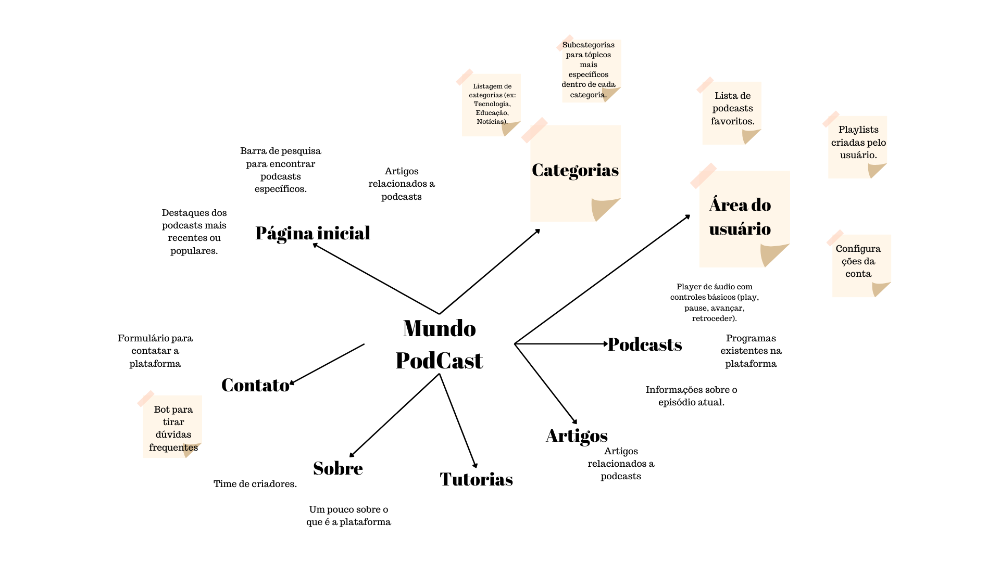

# Mapa mental 

Um mapa mental é uma ferramenta visual que utilizamos para organizar informações de forma hierárquica e ramificada em torno de um conceito central. Ele nos permite representar conexões e ideias de maneira clara e eficaz, usando palavras-chave, imagens e cores para facilitar a compreensão, memorização e planejamento de informações complexas. Essa técnica é valiosa tanto para estudo quanto para brainstorming e organização de projetos.

## O que foi feito

No contexto do nosso projeto com o site mundopodcast.com.br, utilizamos o mapa mental como uma forma de visualizar o fluxo de uso do site e também incluímos sugestões de melhorias através de post-its. Começamos com o conceito central do site e depois ramificamos para diferentes áreas, como a página inicial, categorias de podcasts, entre outros. Em seguida, adicionamos post-its com sugestões específicas para cada área, funcionalidades adicionais, entre outros aspectos.

Essa abordagem nos permitiu ter uma visão ampla do site e das possíveis melhorias, ao mesmo tempo em que facilitou a identificação de áreas prioritárias para focar. Além disso, o uso de post-its tornou mais fácil reorganizar e atualizar as sugestões conforme necessário, garantindo que o processo de planejamento seja flexível e adaptável às necessidades em constante evolução do site e dos usuários.

## Histórico de versão

| Data | Versão | Atividade | Responsável |
| ---- | ------ | --------- | ----------- |
| 07/04/2024 | 1.0 | Adicionar mapa mental | Ana Beatriz Massuh, Delziron Braz |
