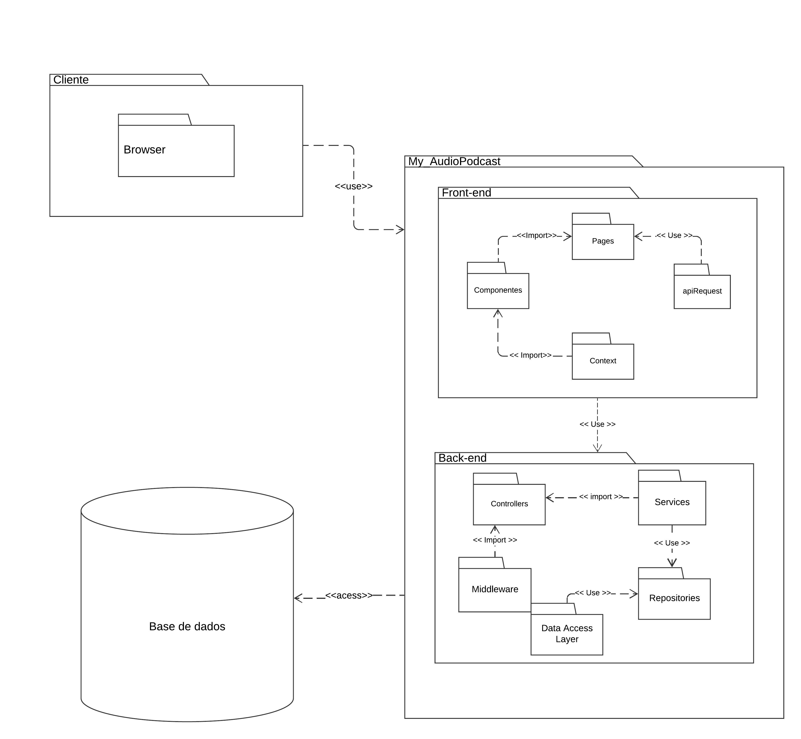

# Diagrama de Pacotes

## Introdução
No contexto da engenharia de software, a utilização de diagramas UML (Unified Modeling Language) é essencial para a modelagem e documentação de sistemas complexos. Entre os diversos tipos de diagramas estruturais disponíveis, o diagrama de pacotes destaca-se por sua capacidade de organizar e modularizar componentes de um sistema, promovendo uma visão clara e hierárquica da estrutura do projeto. Este artefato tem como objetivo apresentar e detalhar a diagramação UML de pacotes, aplicada ao site [Mundo Podcast](https://mundopodcast.com.br/).

### Diagrama de Pacotes

O diagrama de pacotes é uma representação estrutural e estática que tem como objetivo mostrar a disposição de pacotes (conjuntos de elementos) dentro de um projeto. Ele foca nas pastas do projeto e na hierarquia entre elas. Entre os benefícios de utilizar diagramas de pacotes, podemos destacar:

### Notações 
É importante ressaltar algumas relações de dependência entre os pacotes, tais como:

- << Access >> Indica que um pacote requer assistência das funções de outro pacote.
- << Import >>: O pacote de onde a seta parte importa alguma característica do outro pacote.
- << Merge >>: O pacote e sua dependência são unidos em um só.
- << Use >>: Ocorre quando um determinado elemento nomeado requer outro para sua definição e implementação completa.

## Metodologia
Para elaborar o diagrama de pacotes, o membro responsável optou por selecionar os pacotes mais fundamentais das principais tecnologias utilizadas.

## Diagramas
Para este diagrama foi priorizado os pacotes mais essenciais:

_Imagem 1: Diagrama de pacotes(Fonte: Milena Aires, 2024)_

## Pacotes do Diagrama

### Frontend

Este pacote está diretamente relacionado à UI/UX do produto. Nele, temos subpacotes relacionados ao design do produto e sua relação com um outro serviço. Seguem os subpacotes:

- Componentes: Responsável por armazenar microestruturas que serão combinadas no subpacote de páginas. No contexto específico, inclui componentes como o de produto, que encapsula todos os dados de um produto exibido ao usuário.
- Context: Encarregado de realizar requisições HTTP a serviços externos, como o backend, e armazenar dados globais usados pela aplicação. A aplicação utiliza uma API própria.
- Pages: Responsável por armazenar as páginas que interagem diretamente com o usuário. Exemplos incluem páginas de login, cadastro, produtos, entre outras.
- ApiRequest: A API é usada para buscar dados do backend e fornecer essas informações para as páginas e contextos do frontend. 

### Backend

Este pacote está relacionado ao intermédio entre o pacote de Banco de dados e o de frontend. Seguem os subpacotes:

- Controllers: Gerenciam as operações relacionadas aos usuários, podcasts, e comentários. Cada um desses controllers é responsável por coordenar as interações entre a interface de usuário e a lógica de negócio correspondente.
- Middleware: Inclui componentes como Authentication, Authorization e Logging. O middleware de autenticação verifica a identidade do usuário, enquanto o de autorização valida permissões para ações específicas. O logging registra eventos para auditoria e debug.
- Services: Englobam a lógica de negócio para usuários, podcasts e comentários. Cada serviço encapsula as regras e operações relacionadas a esses domínios específicos.
- Repositories: Responsáveis pela persistência e recuperação de dados dos usuários, podcasts e comentários. Cada repositório oferece métodos para interagir com o banco de dados correspondente.
- Data Access Layer (DAL): Composto por DatabaseConnection para gerenciar a conexão com o banco de dados e ORM (Object-Relational Mapping) para facilitar a interação com os dados no banco, transformando objetos em registros e vice-versa.

## Bibliografia

> [1] O que é um diagrama UML? Lucidchart. Disponível em: <https://www.lucidchart.com/pages/pt/o-que-e-uml>. Acesso em: 08 jul. 2024.
>
>
> [2] Tutorial sobre diagramas de pacotes UML. Lucidchart. Disponível em: <https://www.lucidchart.com/pages/pt/diagrama-de-pacotes-uml>. Acesso em: 08 jul. 2024.
>
> [3] Context – React. Reactjs.org. Disponível em: <https://legacy.reactjs.org/docs/context.html>. Acesso em: 08 jul. 2024.
>
>
> [4] Tutorial sobre diagramas de pacotes UML. Lucidchart. Disponível em: <https://www.lucidchart.com/pages/pt/diagrama-de-pacotes-uml>. Acesso em: 08 jul. 2024.

## Histórico de Versão

| Data       | Versão | Modificação      | Autor      | Revisor |
|------------|--------|------------------|------------|---------|
| 09/07/2024 | 1.0    | Criação e confeecção do artefato | Milena Aires | Caio Lucas e Caio Braga  |