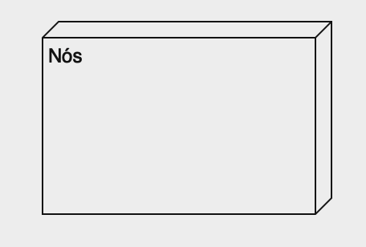
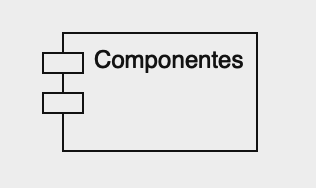
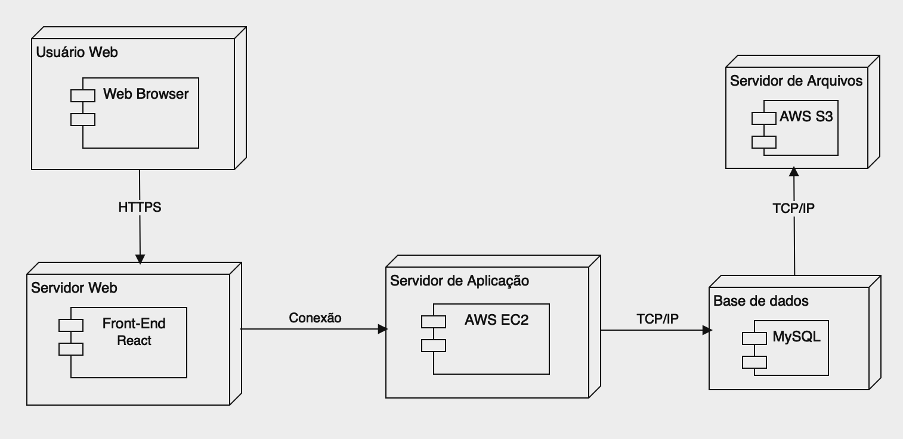

# Diagrama de Classes

## Introdução

Os diagramas de modelagem estáticos descrevem a estrutura estática de um sistema e suas partes em diferentes níveis de abstração e implementação, bem como a forma como essas partes se relacionam entre si, segundo Fakhroutdinov (2023). Dentre esses diagramas, o Diagrama de Implantação se destaca por modelar a arquitetura física de um sistema. Em outras palavras, representa o ambiente em que o sistema será executado, mostrando como os componentes do sistema são implantados em hardware ou ambientes de execução de software.

Os principais elementos gráficos desse diagrama são nós e associações. Os nós representam dispositivos que realizam algum tipo de processamento, enquanto as associações são os relacionamentos entre esses nós. Esses elementos permitem ilustrar como os artefatos de software, resultantes do processo de desenvolvimento, como arquivos, bibliotecas, esquemas de bancos de dados, arquivos de configuração e entre outros, são distribuídos e interconectados em seu ambiente de execução.

No presente documento, apresentamos o Diagrama de Implantação modelado a respeito do sistema do [Mundo Podcast](https://mundopodcast.com.br), destacando como os diversos componentes do sistema são distribuídos e interconectados em seu ambiente de execução.

## Metodologia

Para a elaboração do Diagrama de Implementação, foi analisado a arquitetura do sistema [Mundo Podcast](https://mundopodcast.com.br), focando na comunicação entre seus componentes.

Foi realizado a pesquisa sobre Diagramas de Implementação, onde a mesma incluiu fontes bibliográficas e documentação padrão da UML. Utilizando a plataforma Lucidchart para a confecção do mesmo.

O diagrama foi construído representando o fluxo de comunicação. A equipe seguiu as recomendações de sala de aula e documentações fornecidas pela professora. Diagramas anteriores, como o Diagrama de Pacotes, também foram usados como referência para garantir consistência e integração entre os diagramas.

## Componentes do Diagrama

### Nós

Figura 1: Nós

### Componentes

Figura 2: Componentes

### Associação

Figura 3: Associação

## Desenvolvimento

### Ferramenta utilizada

Para o desenvolvimento do Diagrama de Classe, foi utilizada a ferramenta [Drawio](https://www.drawio.com). O qual facilitou a realização do mesmo

### Diagrama de Implementação

Figura 4: Diagrama de Implementação

## Conclusão

A criação do Diagrama de Implementação foi extremamente útil para entender as opções de arquitetura física do sistema e a integração entre suas diversas partes. O diagrama detalhou como essas partes se comunicam e trocam informações, proporcionando uma representação visual que facilita uma compreensão mais intuitiva desses aspectos.

## Bibliografia

> BAKHROUTDINOV, Kirill. UML. UML 2.5 Diagrams Overview. [S. l.], 2023. Disponível em: https://www.uml-diagrams.org/uml-25-diagrams.html

> O que é um diagrama de implementação? Disponível em: https://www.lucidchart.com/pages/pt/o-que-e-diagrama-de-implementacao-uml

> O Guia Fácil de Diagramas de Implantação UML . Disponível em: https://creately.com/blog/pt/diagrama/tutorial-do-diagrama-de-implantacao/#:~:text=Um%20diagrama%20de%20implanta%C3%A7%C3%A3o%20%C3%A9,software%20f%C3%ADsico%20de%20um%20sistema

## Histórico de Versão

| Data       | Versão | Modificação                 | Autor              | Revisor        |
| ---------- | ------ | --------------------------- | ------------------ | -------------- |
| 07/07/2024 | 0.1    | Criação do Documento        | João Gabriel Elvas | Arthur D'Assumpção & Emerson Teles|
| 09/07/2024 | 0.2    | Desenvolvimento do Artefato | João Gabriel Elvas | Arthur D'Assumpção & Emerson Teles|

