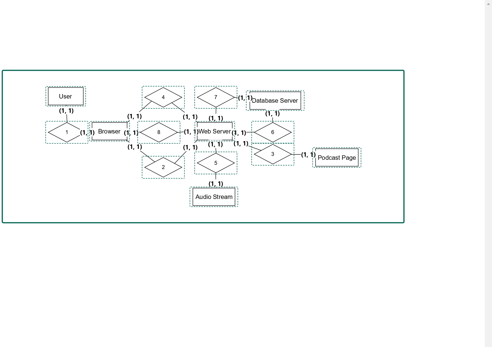

# Diagrama de Colaboração para o Site "Mundo Podcast"

## Introdução

Os diagramas de colaboração, também conhecidos como diagramas de comunicação, são uma forma eficaz de visualizar as interações entre diferentes objetos ou componentes de um sistema. Esses diagramas destacam a troca de mensagens e a sequência das interações, proporcionando uma visão clara de como os elementos do sistema colaboram para realizar uma tarefa específica.

## Metodologia

Para criar um diagrama de colaboração, seguimos os passos abaixo:

1. _Identificação dos Componentes_: Primeiro, identificamos todos os componentes envolvidos na interação. No caso do site "Mundo Podcast", os componentes são o usuário, o navegador, o servidor web, a página do podcast, o serviço de streaming de áudio e o servidor de banco de dados.
2. _Definição das Interações_: Em seguida, mapeamos as interações entre esses componentes, especificando a sequência das mensagens trocadas. Cada interação é numerada para indicar a ordem em que ocorre.
3. _Desenho do Diagrama_: Utilizamos formas geométricas básicas para representar cada componente e setas para mostrar a direção e a sequência das mensagens. O diagrama é então montado para ilustrar claramente o fluxo de comunicação entre os componentes.

#### Sequência de Mensagens

1. **User** -> **Browser**: Solicitação da página do podcast (Mensagem 1)
2. **Browser** -> **Web Server**: Requisição da página do podcast (Mensagem 2)
3. **Web Server** -> **Podcast Page**: Retorna a página do podcast (Mensagem 3)
4. **Browser** -> **Web Server**: Solicitação de streaming de áudio (Mensagem 4)
5. **Web Server** -> **Audio Stream**: Obtenção do streaming de áudio (Mensagem 5)
6. **Web Server** -> **Database Server**: Consulta informações adicionais (Mensagem 6)
7. **Database Server** -> **Web Server**: Retorno das informações solicitadas (Mensagem 7)
8. **Web Server** -> **Browser**: Envio das informações adicionais (Mensagem 8)

Esses graus de relacionamento assumem uma comunicação simples e direta entre os componentes, cada um interagindo com um único outro componente por vez.

## Histórico de Versão

| Data       | Versão | Modificação                                | Autor                              | Revisor      |
| ---------- | ------ | ------------------------------------------ | ---------------------------------- | ------------ |
| 09/07/2024 | 0.1    | Criação do Documento                       | Arthur D'Assumpção e Emerson Teles | João Gabriel Elvas |
| 09/07/2024 | 0.2    | Desenvolvimento do Diagrama de Colaboração | Arthur D'Assumpção e Emerson Teles | João Gabriel Elvas |
