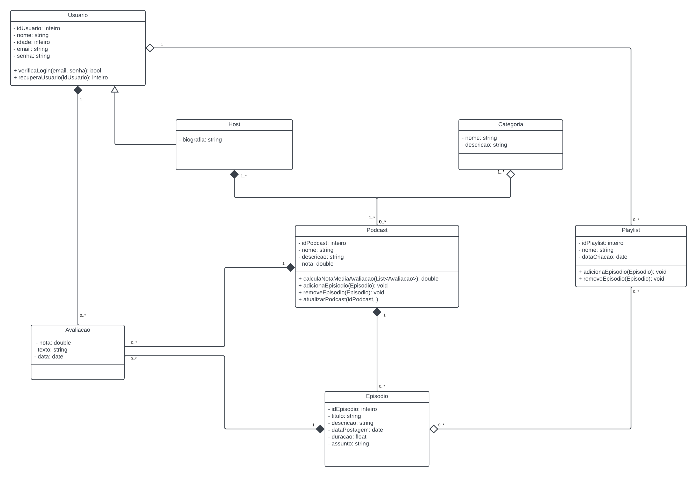

# Diagrama de Classes

## Introdução
Os diagramas de classe UML - _**Unified Modeling Language**_ - são fundamentais para o processo de modelagem de objetos e modelam a estrutura estática de um sistema. Tais diagramas modelam as classes do sistema, seus atributos, operações e relações entre os objetos.

Os diagramas de classe oferecem uma visão geral das classes que compõem o sistema e como elas interagem entre si. Eles representam as classes como retângulos contendo o nome da classe, seus atributos e operações. As relações entre as classes são ilustradas através de linhas que conectam os retângulos, podendo incluir diferentes tipos de associações, como herança, agregação, composição e dependência.

A utilização de diagramas de classe UML permite uma melhor compreensão da arquitetura do sistema, facilita a comunicação entre os membros da equipe de desenvolvimento e serve como documentação para o projeto. Além disso, auxilia na identificação de responsabilidades das classes e na definição clara das interações e dependências entre os diferentes componentes do sistema, promovendo uma arquitetura bem definida e mais fácil de manter e evoluir.

## Detalhamento do Diagrama de Classes

#### Componentes do Diagrama
Os componentes principais dos diagramas de classe incluem:

- **Classes**: Representam entidades no sistema com atributos e operações.
- **Atributos**: Características ou propriedades das classes.
- **Operações**: Métodos ou funções que podem ser executados pelas classes.
- **Relações**: Conexões entre as classes que mostram como elas interagem, como:
   - **Associação**: Representa um vínculo entre duas classes.
   - **Agregação**: Uma forma de associação que indica uma relação "todo/parte".
   - **Composição**: Uma forma mais forte de agregação que indica que o ciclo de vida das partes depende do todo.
   - **Herança**: Representa uma relação hierárquica entre uma classe base e suas classes derivadas.
   - **Dependência**: Indica que uma classe usa ou depende de outra de alguma forma.

Além desses componentes, os diagramas de classe também podem incluir interfaces, enumerados e pacotes para organizar e modularizar o sistema.

#### Modificadores de acesso dos atributos
Os atributos de uma classe podem possuir diferentes níveis de acesso, à depender dos modificadores de acesso que atribuímos à esses atributos. Os principais modificadores de acesso são:

- **Público (+)**: Atributos públicos podem ser acessados de qualquer parte do programa. Isso significa que não há restrições sobre quem pode visualizar ou modificar esses atributos. No diagrama de classe, são representados pelo símbolo `+` antes do nome do atributo.

- **Privado (-)**: Atributos privados só podem ser acessados dentro da própria classe onde são definidos. Nenhuma outra classe pode acessar ou modificar esses atributos diretamente. Esse nível de acesso é representado pelo símbolo `-` no diagrama de classe.

- **Protegido (#)**: Atributos protegidos podem ser acessados dentro da própria classe e por classes derivadas (subclasses). Eles fornecem um nível intermediário de proteção, permitindo que subclasses tenham acesso aos atributos enquanto ainda os ocultam de outras partes do programa. São representados pelo símbolo `#` no diagrama de classe.

## Desenvolvimento
### Ferramenta utilizada
Para o desenvolvimento do Diagrama de Classe, foi utilizada a ferramenta **_[LucidChart](https://wwww.lucidchart.com)_**.
O LucidChart é uma poderosa ferramenta de diagramação e visualização baseada na nuvem, amplamente utilizada para criar diagramas de fluxo, mapas mentais, organogramas, wireframes, diagramas de rede e diagramas UML, entre outros. 

### Diagrama de Classe
Para o objetivo do nosso projeto de uma plataforma de Podcasts, baseado no site **_[Mundo Podcast](https://mundopodcast.com.br/)_**, foi desenvolvido o seguinte diagrama de classe utilizando os **_[requisitos do projeto](../Base/ElicitacaoRequisitos/Elicitacao.md)_** como refência, conforme a Figura 1:

Clique **[aqui](https://lucid.app/lucidchart/b827c64f-0df4-4040-b0cf-4589cd4e83fd/edit?viewport_loc=-2415%2C-1277%2C4033%2C1878%2C0_0&invitationId=inv_1f991ede-39cc-4104-9996-309081fcb48b)** para melhor visualização do diagrama.

Figura 1: Diagrama de Classe UML

## Conclusão
O uso de diagramas de classe UML se mostrou essencial para o desenvolvimento estruturado e compreensível do sistema planejado. Através da ferramenta LucidChart, foi possível criar um diagrama de classe detalhado, que modela as entidades do sistema, seus atributos, operações e as relações entre elas. 

Com os diagramas, conseguimos identificar claramente as responsabilidades de cada classe e como elas interagem, promovendo uma arquitetura bem definida e preparada para futuras evoluções.

A ferramenta LucidChart foi fundamental para esse processo, oferecendo uma interface intuitiva e recursos colaborativos que facilitaram o trabalho e a criação de um artefato visual claro e preciso.

## Bibliografia

> Booch, G., Rumbaugh, J., & Jacobson, I. (2005). _The Unified Modeling Language User Guide_. Addison-Wesley Professional.

> Fowler, M. (2003). _UML Distilled: A Brief Guide to the Standard Object Modeling Language_. Addison-Wesley Professional.

## Histórico de Versão
| Data       | Versão | Modificação      | Autor      | Revisor |
|------------|--------|------------------|------------|---------|
| 07/07/2024 | 0.1    | Criação do Documento | Mateus Franco | À ser revisado  |
| 08/07/2024 | 0.2    | Desenvolvimento do Artefato | Mateus Franco e Leonardo | À ser revisado |
| 09/07/2024 | 0.3    | Correção do Diagrama | Leonardo | À ser revisado |