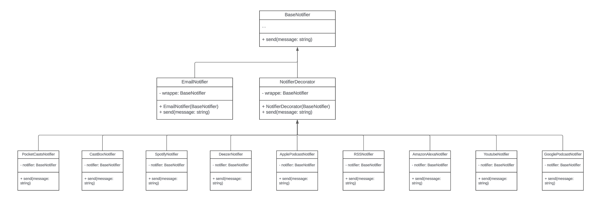

# Módulo Padrões de Projeto GoFs Estruturais

## Introdução

O padrão de projeto 'Decorator', também conhecido como 'Wrapper', é um padrão estrutural que permite adicionar novas responsabilidades a um objeto de forma dinâmica, sem modificar sua estrutura básica. Este padrão é amplamente utilizado no desenvolvimento de software para incrementar funcionalidades a um objeto sem a necessidade de alterar seu código-fonte original. Dessa forma, o 'Decorator' oferece uma maneira flexível e extensível de enriquecer os comportamentos de objetos em tempo de execução.

## Objetivo

A ideia fundamental do padrão 'Decorator' é criar uma série de classes que envolvem o objeto original, adicionando comportamentos ou responsabilidades extras a ele. Essas classes decoradoras implementam a mesma interface do objeto original, permitindo que sejam usadas como substitutas do objeto básico. Dessa forma, é possível extender funcionalidade de maneira flexível e modular, mantendo a integridade da interface original.

## Metodologia

**Identificação da Feature:** Primeiro, identificamos uma funcionalidade específica para aplicar o padrão 'Decorator'. Isso nos permitiu definir claramente o objetivo do uso do decorador e garantir que sua aplicação seria relevante e eficaz.

**Criação do Diagrama:** Utilizamos o [Lucidchart](https://www.lucidchart.com) para elaborar um diagrama que ilustra a estrutura do padrão 'Decorator' aplicado à nossa feature escolhida. Este diagrama ajudou a visualizar as relações entre o objeto original e os diversos decoradores.

**Implementação do Código:** Escrevemos o código em TypeScript para implementar o padrão 'Decorator'.

## Diagrama Decorator

Figura 1: Diagrama Decorator

## Código

## Conclusão

O padrão Decorator aplicado aos notificadores permite uma solução flexível e extensível para a gestão de diferentes tipos de notificações. Esta abordagem modular garante que o sistema seja adaptável a novas necessidades e fácil de manter, promovendo um design eficiente e escalável.

## Bibliografia

> https://refactoring.guru/design-patterns/decorator

> https://refactoring.guru/design-patterns/decorator/typescript/example

> https://www.youtube.com/watch?v=v6tpISNjHf8

## Histórico de Versão

| Data       | Versão | Modificação          | Autor                               | Revisor |
| ---------- | ------ | -------------------- | ----------------------------------- | ------- |
| 24/07/2024 | 0.1    | Criação do Documento | Bruno Henrique e João Gabriel Elvas |         |
