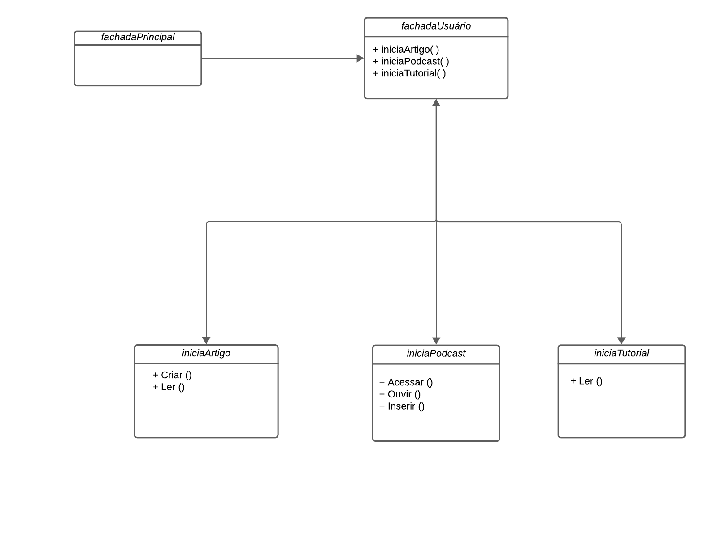

# 3.2. Módulo Padrões de Projeto GoFs Estruturais

## Introdução

Os Padrões Estruturais focam na composição de classes e objetos para formar sistemas mais complexos. Eles definem maneiras eficientes de montar objetos e classes em estruturas maiores, garantindo flexibilidade e eficiência. Esses padrões asseguram que as relações entre os objetos sejam extensíveis e adaptáveis, promovendo uma arquitetura de software robusta e manutenível.

## Metodologia

Para entrega dessa parte do projeto a equipe foi divida em três times, sendo o time Estrutual composto por 5 membros da equipe. Foi decidido em conjunto executar dois padrões estruturais, sendo eles: Facade e Adaptor. Sendo executado da seguinte forma:

|         MEMBRO          | ATIVIDADE |
| :---------------------: | :-------: |
|     Bruno Henrique      | Decorator |
|   João Gabriel Elvas    | Decorator |
|      Milena Aires       |  Facade   |
| Pedro Henrique Caldeira |  Facade   |
|      Samuel Castro      |  Facade   |

No Facade os membros fizeram juntos todas as etapas utilizando o Discord para comunicação e uma extensão do VS code chamada Live Share onde permite uma codificação conjunta.

## Padrão de Projeto Estrutural - Facade

### Base

O padrão estrutural Facade é usado para fornecer uma interface simplificada para um conjunto complexo de classes, bibliotecas ou frameworks. Ele atua como uma fachada, oferecendo um ponto de acesso único e simplificado que oculta a complexidade dos subsistemas internos. Esse padrão é especialmente útil para reduzir a dependência entre o código cliente e as partes internas de um sistema, facilitando o uso e a manutenção.

### Modelagem do Facade



<p align='center'>Figura 1: GoF estrutural Facade. Fonte: Milena Aires, Pedro Caldeira e Samuel Castro 2024.</p>

### Implementação Facade

- _fachadaUsuário_

```py
from facade_user import FacadeUser

class facadeMain:
    def __init__(self):
        self.user = FacadeUser()

    def Article(self):
        self.user.Article()

    def Podcast(self):
        self.user.Podcast()

    def Tutorial(self):
        self.user.Tutorial()
```

- _iniciaArtigo_

```pY
from ..database import Base

class Article(Base):
    def create(self):
        print("Criando um artigo...")

    def read(self):
        print("Lendo um artigo...")
```

- _iniciaPodcast_

```py
   def access(self):
        print("Accessing podcast...")

    def listen(self):
        print("Listening to podcast..")

    def create(self):
        print("Adding new podcast...")
```

- _iniciaTutorial_

```py
from ..database import Base

class Tutorial(Base):
    def read(self):
        print("Lendo um tutorial...")
```

## Bibliografia

> GRAN Cursos Online. Padrões de Projetos GoF: Padrões Estruturais. Disponível em: https://blog.grancursosonline.com.br/padroes-de-projetos-gof-padroes-estruturais/. Acesso em: 24 jul. 2024.

> Milene. (n.d.). Arquitetura e desenho de software: Aula GoFs Estruturais. Universidade de Brasília. https://aprender3.unb.br/pluginfile.php/2790265/mod_label/intro/Arquitetura%20e%20Desenho%20de%20Software%20-%20Aula%20GoFs%20Estruturais%20-%20Profa.%20Milene.pdf

## Histórico de Versão

| Data       | Versão | Modificação                                             | Autor                                        | Revisor        |
| ---------- | ------ | ------------------------------------------------------- | -------------------------------------------- | -------------- |
| 24/07/2024 | 1.0    | Criação da documentção e adição de todas as informações | Milena Aires, Pedro Caldeira e Samuel Castro | à ser revisado |
